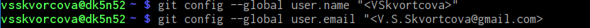

---
## Front matter
title: "Шаблон отчёта по лабораторной работе"
subtitle: "Простейший вариант"
author: "Дмитрий Сергеевич Кулябов"

## Generic otions
lang: ru-RU
toc-title: "Содержание"

## Bibliography
bibliography: bib/cite.bib
csl: pandoc/csl/gost-r-7-0-5-2008-numeric.csl

## Pdf output format
toc: true # Table of contents
toc-depth: 2
lof: true # List of figures
lot: true # List of tables
fontsize: 12pt
linestretch: 1.5
papersize: a4
documentclass: scrreprt
## I18n polyglossia
polyglossia-lang:
  name: russian
  options:
	- spelling=modern
	- babelshorthands=true
polyglossia-otherlangs:
  name: english
## I18n babel
babel-lang: russian
babel-otherlangs: english
## Fonts
mainfont: IBM Plex Serif
romanfont: IBM Plex Serif
sansfont: IBM Plex Sans
monofont: IBM Plex Mono
mathfont: STIX Two Math
mainfontoptions: Ligatures=Common,Ligatures=TeX,Scale=0.94
romanfontoptions: Ligatures=Common,Ligatures=TeX,Scale=0.94
sansfontoptions: Ligatures=Common,Ligatures=TeX,Scale=MatchLowercase,Scale=0.94
monofontoptions: Scale=MatchLowercase,Scale=0.94,FakeStretch=0.9
mathfontoptions:
## Biblatex
biblatex: true
biblio-style: "gost-numeric"
biblatexoptions:
  - parentracker=true
  - backend=biber
  - hyperref=auto
  - language=auto
  - autolang=other*
  - citestyle=gost-numeric
## Pandoc-crossref LaTeX customization
figureTitle: "Рис."
tableTitle: "Таблица"
listingTitle: "Листинг"
lofTitle: "Список иллюстраций"
lotTitle: "Список таблиц"
lolTitle: "Листинги"
## Misc options
indent: true
header-includes:
  - \usepackage{indentfirst}
  - \usepackage{float} # keep figures where there are in the text
  - \floatplacement{figure}{H} # keep figures where there are in the text
---

# Цель работы

Здесь приводится формулировка цели лабораторной работы. Формулировки
цели для каждой лабораторной работы приведены в методических
указаниях.

Цель данного шаблона --- максимально упростить подготовку отчётов по
лабораторным работам.  Модифицируя данный шаблон, студенты смогут без
труда подготовить отчёт по лабораторным работам, а также познакомиться
с основными возможностями разметки Markdown.

# Задание

Здесь приводится описание задания в соответствии с рекомендациями
методического пособия и выданным вариантом.

# Теоретическое введение

Здесь описываются теоретические аспекты, связанные с выполнением работы.

Например, в табл. [-@tbl:std-dir] приведено краткое описание стандартных каталогов Unix.

: Описание некоторых каталогов файловой системы GNU Linux {#tbl:std-dir}

| Имя каталога | Описание каталога                                                                                                          |
|--------------|----------------------------------------------------------------------------------------------------------------------------|
| `/`          | Корневая директория, содержащая всю файловую                                                                               |
| `/bin `      | Основные системные утилиты, необходимые как в однопользовательском режиме, так и при обычной работе всем пользователям     |
| `/etc`       | Общесистемные конфигурационные файлы и файлы конфигурации установленных программ                                           |
| `/home`      | Содержит домашние директории пользователей, которые, в свою очередь, содержат персональные настройки и данные пользователя |
| `/media`     | Точки монтирования для сменных носителей                                                                                   |
| `/root`      | Домашняя директория пользователя  `root`                                                                                   |
| `/tmp`       | Временные файлы                                                                                                            |
| `/usr`       | Вторичная иерархия для данных пользователя                                                                                 |

Более подробно про Unix см. в [@tanenbaum_book_modern-os_ru; @robbins_book_bash_en; @zarrelli_book_mastering-bash_en; @newham_book_learning-bash_en].

# Выполнение лабораторной работы

Делаем предварительную конфигурацию. Указываем имя и email владельца репозитория (рис. [-fig:001])
{#fig:001 width=97%}

Настраиваем utf-8 (рис. [-fig:002])
![uf-] (image/02.png){#fig:002 width=96%}

Зададим имя начальной ветки (рис. [-fig:100%])
![Имя ветки] (image/03.png){#fig:003 wigth=98%}

Задаём параметр autocrlf и safecrlf (рис. [-fig:004]
![Параметры] (image/04.png) {fig:#004 wigth=95%}

Генирируем приватный и открытый ключ для последующей идентификации пользователя (рис. [-fig:005])
![Ключ] (image/05.png) {fig:#005 wight=96%}

Далее загружаем сгенерированный открытый ключ. копируем в буфер обмена из локальной консоли и вставляем его в поле для ключа, дав ему имя "pub dk key" (рис. [-fig:006],[-fig:007])
![Генирируем ключ] (image/06.png) {fig:#006 wight=97%}
![Сгенерированный ключ] (image/07.png) {fig:#007 wight=95%}

Создаём каталог на терминале для предмета "архитектура компьютера" и переходим в него (рис. [-fig:008])
![Каталог "архитектура компьютера"] (image/08.png) {fig:#008 wight=97%}

Создаём репозиторий по шаблону курса, с именем "study_2023-2024_arh-pc" (рис. [-fig:009])
![Репозиторий] (image/09.png) {fig:#009 wight=97%}

Клонируем созданный репзиторий (рис. [-fig:010])
![Клонирование] (image/10.png) {fig:#010 wight=97%}

Переходим в каталог курса и удаляем лишние файлы (рис. [-fig:011])
![Удаление лишних файлов] (image/11.png) {fig:#011 wight=98%}

Создаём необходимые файлы и отправляем их на сервер (рис. [-fig:012], [-fig:013], [-fig:014], [-fig:015], [-fig:016], [-fig:017], [-fig:018])
![Создание файлов 1] (image/12.png) {fig:#012 wight=97%}
![Создание файлов 2] (image/13.png) {fig:#013 wight=96%}
![Создание файлов 3] (image/14.png) {fig:#014 wight=96%}
![Создание файлов 4] (image/15.png) {fig:#015 wight=96%}
![Создание файлов 5] (image/16.png) {fig:#016 wight=96%}
![Создание файлов 6] (imsge/17.png) {fig:#017 wight=96%}
![Отправление на сервер] (image/18.png) {fig:#018 wight=96%}

Проверяем правильность создания иерархии рабочего пространства в локальном репозитории и на странице github (рис. [-fig:019], [-fig:020])
![Локальный репозиторий] (image/19.png) {fig:#019 wight=98%}
![Github] (image/20.png) {fig:020 wight=96%}

# Выводы

Мы приобрели практические навыки по работе с ситемой git, а также изучили средства контроля версий и научились их применять.

# Список литературы{.unnumbered}

::: {#refs}
:::
