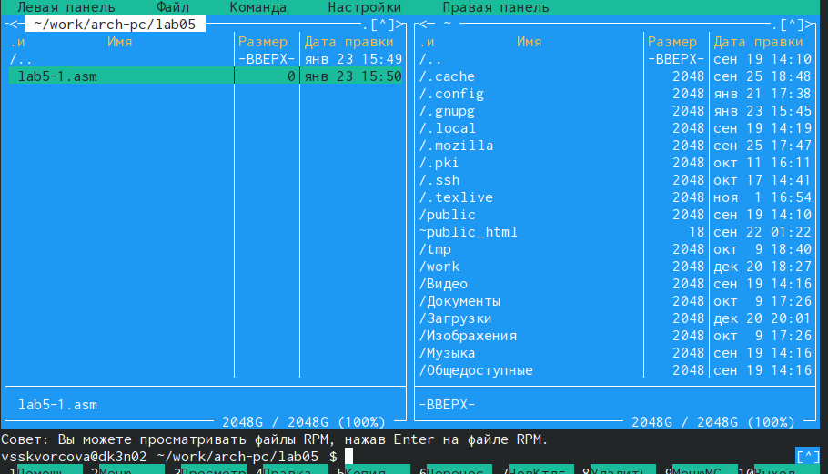
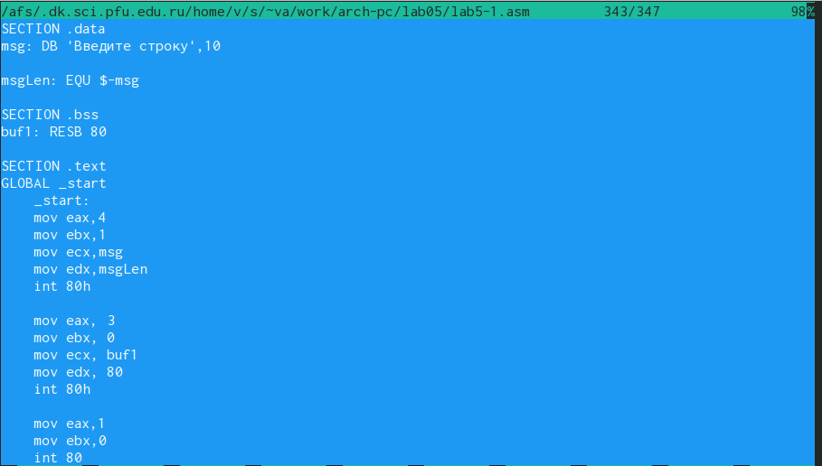
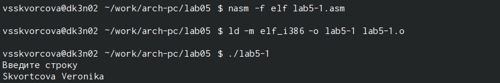
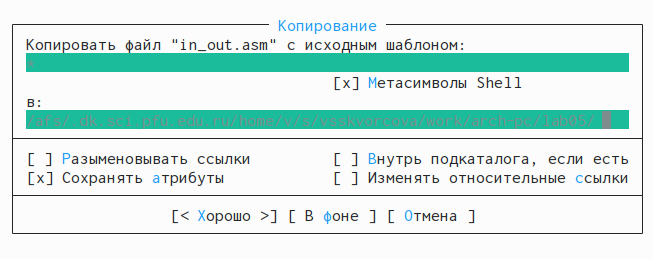
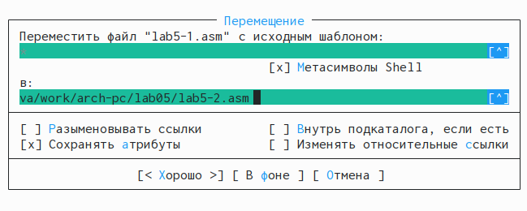
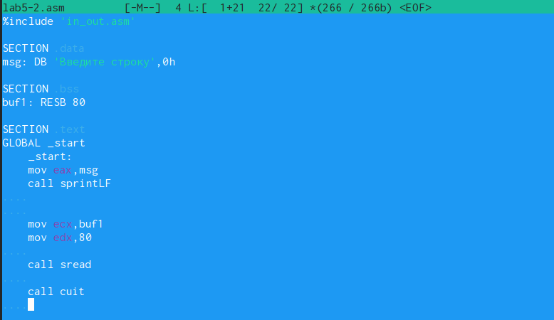
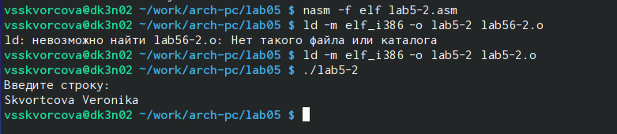
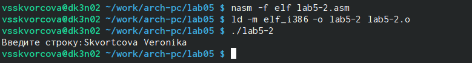
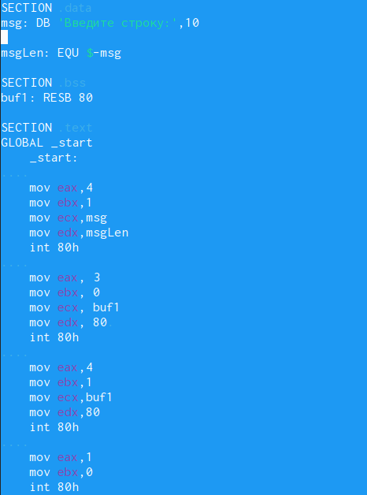
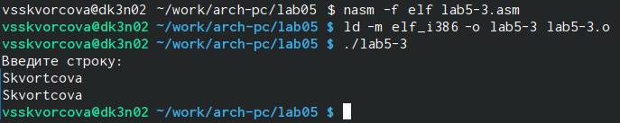

---
## Front matter
title: "Шаблон отчёта по лабораторной работе"
subtitle: "Простейший вариант"
author: "Дмитрий Сергеевич Кулябов"

## Generic otions
lang: ru-RU
toc-title: "Содержание"

## Bibliography
bibliography: bib/cite.bib
csl: pandoc/csl/gost-r-7-0-5-2008-numeric.csl

## Pdf output format
toc: true # Table of contents
toc-depth: 2
lof: true # List of figures
lot: true # List of tables
fontsize: 12pt
linestretch: 1.5
papersize: a4
documentclass: scrreprt
## I18n polyglossia
polyglossia-lang:
  name: russian
  options:
	- spelling=modern
	- babelshorthands=true
polyglossia-otherlangs:
  name: english
## I18n babel
babel-lang: russian
babel-otherlangs: english
## Fonts
mainfont: IBM Plex Serif
romanfont: IBM Plex Serif
sansfont: IBM Plex Sans
monofont: IBM Plex Mono
mathfont: STIX Two Math
mainfontoptions: Ligatures=Common,Ligatures=TeX,Scale=0.94
romanfontoptions: Ligatures=Common,Ligatures=TeX,Scale=0.94
sansfontoptions: Ligatures=Common,Ligatures=TeX,Scale=MatchLowercase,Scale=0.94
monofontoptions: Scale=MatchLowercase,Scale=0.94,FakeStretch=0.9
mathfontoptions:
## Biblatex
biblatex: true
biblio-style: "gost-numeric"
biblatexoptions:
  - parentracker=true
  - backend=biber
  - hyperref=auto
  - language=auto
  - autolang=other*
  - citestyle=gost-numeric
## Pandoc-crossref LaTeX customization
figureTitle: "Рис."
tableTitle: "Таблица"
listingTitle: "Листинг"
lofTitle: "Список иллюстраций"
lotTitle: "Список таблиц"
lolTitle: "Листинги"
## Misc options
indent: true
header-includes:
  - \usepackage{indentfirst}
  - \usepackage{float} # keep figures where there are in the text
  - \floatplacement{figure}{H} # keep figures where there are in the text
---

# Цель работы

Приобретение практических навыков работы в Midnight Commander. Освоение инструкций языка ассемблера mov и int.

Цель данного шаблона --- максимально упростить подготовку отчётов по
лабораторным работам.  Модифицируя данный шаблон, студенты смогут без
труда подготовить отчёт по лабораторным работам, а также познакомиться
с основными возможностями разметки Markdown.

# Задание

Здесь приводится описание задания в соответствии с рекомендациями
методического пособия и выданным вариантом.

# Теоретическое введение

Здесь описываются теоретические аспекты, связанные с выполнением работы.

Например, в табл. [-@tbl:std-dir] приведено краткое описание стандартных каталогов Unix.

: Описание некоторых каталогов файловой системы GNU Linux {#tbl:std-dir}

| Имя каталога | Описание каталога                                                                                                          |
|--------------|----------------------------------------------------------------------------------------------------------------------------|
| `/`          | Корневая директория, содержащая всю файловую                                                                               |
| `/bin `      | Основные системные утилиты, необходимые как в однопользовательском режиме, так и при обычной работе всем пользователям     |
| `/etc`       | Общесистемные конфигурационные файлы и файлы конфигурации установленных программ                                           |
| `/home`      | Содержит домашние директории пользователей, которые, в свою очередь, содержат персональные настройки и данные пользователя |
| `/media`     | Точки монтирования для сменных носителей                                                                                   |
| `/root`      | Домашняя директория пользователя  `root`                                                                                   |
| `/tmp`       | Временные файлы                                                                                                            |
| `/usr`       | Вторичная иерархия для данных пользователя                                                                                 |

Более подробно про Unix см. в [@tanenbaum_book_modern-os_ru; @robbins_book_bash_en; @zarrelli_book_mastering-bash_en; @newham_book_learning-bash_en].

# Выполнение лабораторной работы

{#fig:001 width=97%}
С помощью клавиши F7 создаём папку lab05. В ней с помощью команды touch создаём файл lab5-1.asm (рис. [-@fig:001])

{#fig:002 width=97%}
С помощью клавиши F4 открываем файл lab5-1.asm для редактирова-
ния и вписываем текст программы (рис. [-@fig:002])

{#fig:003 width=97%}
Оттранслируем текст программы lab5-1.asm в объектный файл. Выполним компоновку объектного файла и запустим получившийся исполняемый файл. На запрос вводим свою фамилию и имя (рис. [-@fig:003])

{fig:004 width=95%}
Скачиваем файл in_out.asm. В одной из панелей mc открываем каталог с файлом lab5-1.asm. В другой панели каталог со скаченным файлом in_out.asm. Копируем файл in_out.asm в каталог с файлом lab5-1.asm с помощью клавиши F5 (рис. [-@fig:004])

{fig:005 width=95%}
С помощью клавиши F6 создаём копию файла lab5-1.asm с именем
lab5-2.asm (рис. [-@fig:005])

{fig:006 width=96%}
Исправляем текст программы в файле lab5-2.asm с использование подпрограмм из внешнего файла in_out.asm (рис. [-@fig:006])

{fig:007 width=96%}
Проверяем работу исполняемого файла (рис.[-@fig:007])

{fig:008 width=96%}
В файле lab5-2.asm заменяем подпрограмму sprintLF на sprint и проверяем. Теперь у нас выводится сообщение на экран без перевода строки (рис. [-@fig:008])

# Самостоятельная работа

{fig:009 width=93%}
Создаём копию файла lab5-1.asm. Внесите изменения в программу так, чтобы она выводила введённую строку на экран (рис. [-@fig:009])

{fig:010 width=96%}
Выполняем компоновку объектного файла и запускаем (рис. [-@fig:010])

{fig:011 width=92%}
Создаём копию файла lab5-2.asm. Внесите изменения в программу так, чтобы она выводила введённую строку на экран (рис. [-@fig:011]0

{fig:012 width=96%}
Выполняем компоновку объектного файла и запускаем (рис. [-@fig:012])

# Выводы

В ходе лабораторной работы мы успешно освоили основные функции файлового менеджера Midnight Commander, что позволило эффективно управлять файлами и директориями в текстовой среде. Также мы изучили команды языка ассемблера mov и int, что дало нам практическое представление о перемещении данных и взаимодействии с системными прерываниями. Приобретённые навыки позволили лучше понять процесс работы с ассемблером и упрощают дальнейшее изучение низкоуровневого программирования.

# Список литературы{.unnumbered}

::: {#refs}
:::
